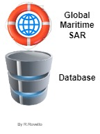
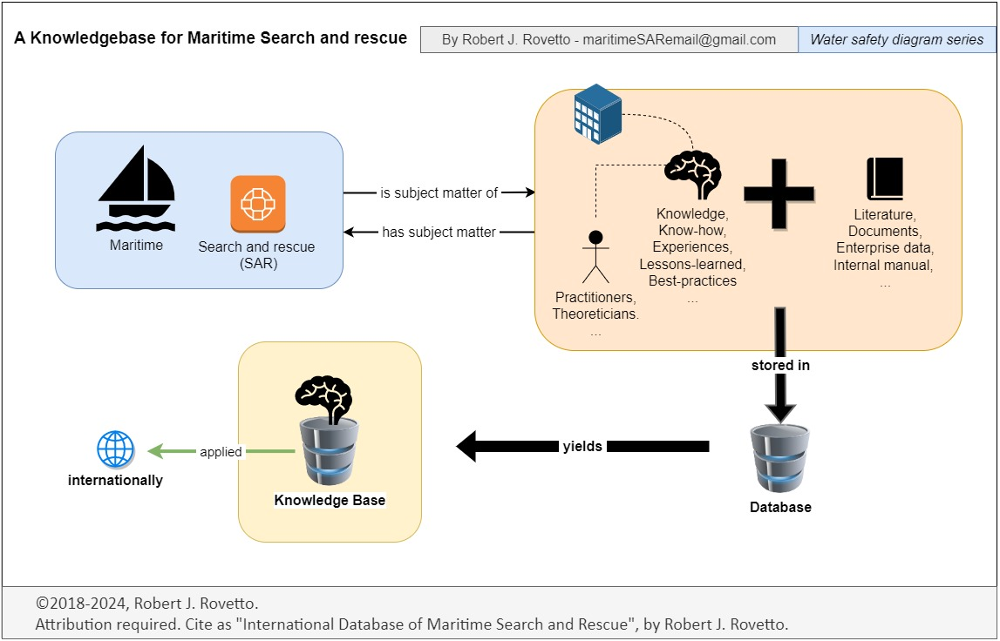
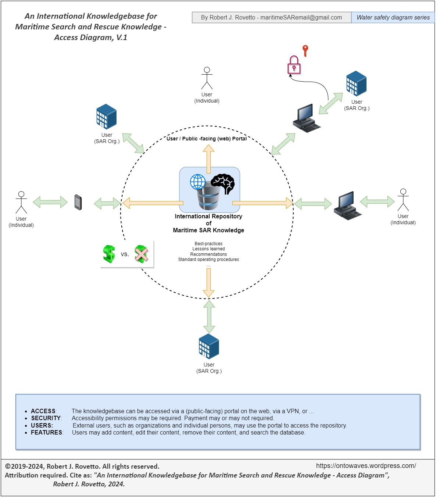

# Maritime Search and Rescue Knowledgebase 
A project developing a database and knowledge sharing framework for maritime search and rescue, including best-practices and lessons-learned. 
[Description online Sutsey](https://www.surtsey.org/projects/the-maritime-search-and-rescue-database)

## Status
- In-progress.
- Formal support is presently need: partner organizations, funding, technological resources, ...

## Description

The goal of this project is to create an internationally-accessible database for the global maritime search and rescue (SAR community to access and add entries about: lessons-learned, best-practices, and recommendations for operations, managemenet and other topics. In all this supports an organizations _knowledge management_ strategy in the following ways. The database containing the target information can be understood as a knowledgebase. This single or multiple knowledgebase(s) facilitates _knowledge preservation_. The intertnational scope, accessibility, and contributions facilitates knowledge transfer and knowledge exchange/sharing; it also afford future data analysis for added _knowledge discovery_. 

The scope includes preserving and storing:
- essential know-how and information for safety and successfully conducting water SAR missions and training exercises
- the implicit knowledge held and learned by seasoned practitioners
- data and discoveries from data or studies
- organizational or internal best-practices that a given org. is willing to share as a global recommendation
- 101 essential knowledge
- interpersonal and management knowledge that helfully facilitate mission success, positive and safe marine SAR culture,
- etc. 

##  Author
[Robert J. Rovetto](https://github.com/rrovetto) -- [Contact](mailto:rrovetto@terpalum.umd.edu)
- Maritime safety professional, Certified commercial mariner, Philosopher, Concept Engineer, [Formal ontologist](https://ontologforum.org/index.php/RobertRovetto), Knowledge representation practitioner
- [Directly hire for knowledge modeling at this website](https://tinyurl.com/yas7trzy) or [contact](rrovetto@terpalum.umd.edu) for alternative arrangements.

## Works
- **Database online** - Contact to submit entries to the best-practices database. [Online location](https://docs.google.com/spreadsheets/d/12O3wvgPsFdO-vG8awN8Y7sLTJ5P5NIpn/)
- "KnowSAR - Toward an International Maritime SAR Database and Knowledgebase", Grant proposal submitted (but rejected) to Lloyds Register Small Grant Scheme.
- **2019 Proposal** - “Consolidating and Sharing maritime SAR Information for Improved Training - One project proposal and One call for contributions”, Submisison to World Maritime Rescue Congress (an IMRF-International Maritime Rescue Congress event), 2019, Canada.
	- [Submission documentation](https://drive.google.com/drive/folders/1wWgdWdPG5B9OlZ5zOEw4n-8LlcuZrk8_?usp=sharing)
	- Email documentation available on request

  
Click to read sample of 2019 proposal

	
"The community stands to improve training by aggregating and sharing maritime SAR information.
This communication discusses two project concepts. One is a project proposal to develop an
international database of maritime SAR best-practices. The other is an ongoing personal project
by the author to develop a bibliography of maritime SAR documents.

The first would be an open-source repository for best-practices in training and in actual 
operations. Any maritime SAR organization, and any individual, would be able to submit
additions to the repository Submitted best-practices or recommendations can be about 
onboard safety aspects to interpersonal aspects to equipment suggestions to detailed 
strategies for particular training evolutions like man-overboard. A best-practices
database can be incorporated into or developed for the IMRF, IMO, or another neutral
organizations.

The second project, an existing compilation of maritime SAR training and standards material is briefly introduced.
Contributions are welcome and should be directed to the author. The author seeks partners and funding to pursue both or either of these 
projects for consolidating maritime SAR information for knowledge sharing and improved training."

“This paper proposes the development of an international database of maritime SAR best-practices. The author (Rovetto) has begun a preliminary repository, drawing on his training and boating experiences. The authors asks the audience if they are interested in contributing to such a repository.  A best-practices database can be incorporated into the IMRF, IMO, or another neutral organization. It should be open and freely accessible. We draw on the collective and diverse experience of the author(s) to offer a list of recommended practices for crew members aboard rescue boats. The practices range from training suggestions, to safety precautions, to managerial and interpersonal approaches. Some maritime SAR organizations employ some of the recommendations, while others do not. Some suggestions may appear obvious, but observing existing paid and unpaid crews will demonstrate gaps in safety, lack of knowledge, etc”

- Paper "Toward an International Database for Maritime Search and Rescue"
- 	submitted to but rejected from Australian Journal of Emergency Management.
- 	submmitted to Journal of Emergency Management.

### Related Projects
- [The Maritime Search and Rescue Bibliography](https://www.surtsey.org/projects/maritime-sar-bibliography), Robert J. Rovetto
  
## Copyright
©2019-2024, Robert J. Rovetto. All rights reserved.
Not authorized for commercial use unless explicitly negotiated with the author. Citation/attribution required.
No warranty. Presented "AS IS". Author and copyright holder is not liable. All content, work and products are subject to revision. No claims to completeness or complete accuracy.

## Attribution
Attribution is required. 
Cite as either: 
- "Maritime Search and Rescue Knowledgebase", Robert J. Rovetto, 2019-2024. GitHub page.
- "International Maritime Search and Rescue Database", Robert J. Rovetto, 2019-2024. GitHub page.
